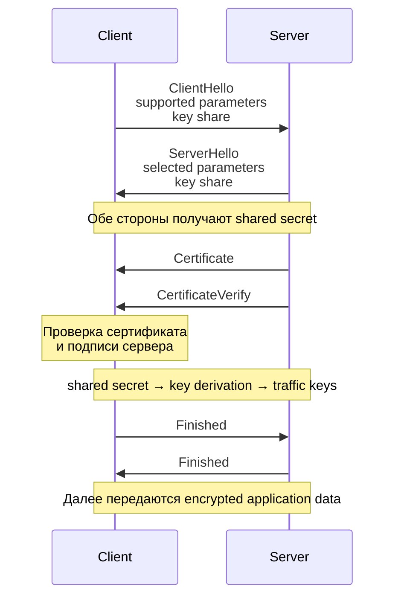
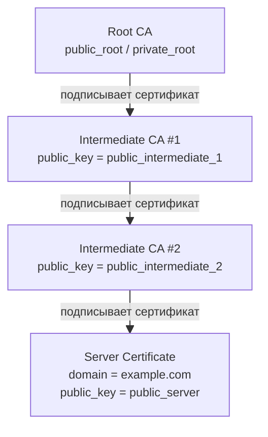

---
## Оглавление

- [[#1. HTTPS, TLS и SSL|1. HTTPS, TLS и SSL]]
- [[#2. Что даёт TLS|2. Что даёт TLS]]
- [[#3. TLS Handshake — общая схема|3. TLS Handshake — общая схема]]
- [[#4. Согласование параметров|4. Согласование параметров]]
- [[#5. Согласование общего секрета|5. Согласование общего секрета]]
- [[#6. Сертификаты и аутентификация сервера|6. Сертификаты и аутентификация сервера]]
- [[#7. Получение ключей и защищённый трафик|7. Получение ключей и защищённый трафик]]

---

# 1. HTTPS, TLS и SSL

**HTTPS (HTTP Secure)** — использование HTTP поверх защищённого канала, создаваемого протоколом **TLS**.

$\boxed{HTTPS = HTTP + TLS}$

HTTP по-прежнему определяет семантику запросов и ответов, а TLS отвечает за защиту передаваемых данных.

## SSL и TLS

**SSL (Secure Sockets Layer)** — предшественник TLS, разработанный для защиты сетевых соединений.

Позже SSL был заменён протоколом **TLS (Transport Layer Security)**, который является его развитием.

Современные SSL-протоколы считаются устаревшими и не должны использоваться. На практике используется TLS.

При этом исторические названия сохранились, поэтому до сих пор можно встретить:

```
SSL/TLS
SSL certificate
SSL connection
```

Хотя обычно фактически имеется в виду **TLS**.

---

# 2. Что даёт TLS

TLS создаёт защищённый канал между клиентом и сервером.

Основные свойства:

- **Confidentiality** — содержимое передаваемых данных шифруется и не может быть прочитано пассивным наблюдателем
- **Integrity** — изменение данных во время передачи обнаруживается
- **Authentication** — клиент может проверить, что соединение установлено именно с нужным сервером
- **Forward Secrecy** — в современных конфигурациях компрометация долговременного ключа сервера не позволяет расшифровать ранее записанные соединения

Эти свойства защищают от основных атак посредника:

```
Client  ←→  Attacker  ←→  Server
```

Без TLS посредник потенциально может:

- читать передаваемые данные
- изменять их
- выдавать себя за настоящий сервер

TLS решает эти задачи комбинацией нескольких механизмов:

- `key agreement` — договор об общем секрете между клиентом и сервером
- `authentication` — клиент убеждается, что общается именно с нужным сервером
- `key derivation` — из общего секрета получают уже конкретные ключи, которыми будет защищаться соединение
- `symmetric encryption` — этими ключами шифруется основной трафик после handshake
- `integrity protection` — позволяет обнаружить, что зашифрованные данные кто-то изменил по дороге

При этом TLS не привязан к одному конкретному алгоритму: допустимые алгоритмы и параметры определяются стандартом и согласовываются сторонами во время handshake.

---

# 3. TLS Handshake — общая схема

**TLS Handshake** — начальный этап TLS-соединения, во время которого клиент и сервер:

- согласовывают параметры соединения
- получают общий секрет
- аутентифицируют сервер
- выводят ключи для дальнейшей защиты трафика

Упрощённо:



Логически handshake можно разбить на несколько этапов:

1. **Согласование параметров** (`ClientHello` и `ServerHello`)
    Клиент и сервер выбирают совместимые криптографические алгоритмы и параметры
    
2. **Key agreement**  (`ClientHello` и `ServerHello`)
    Стороны получают общий секрет, не передавая сам секрет по сети
    
3. **Аутентификация сервера**  (`Certificate` и `CertificateVerify`)
    Клиент проверяет сертификат и доказательство владения приватным ключом  
    Это защищает от MITM-атаки
    
4. **Key derivation**  
    Из общего секрета выводятся конкретные ключи для защиты соединения
    
5. **Finished**  
    Стороны подтверждают, что handshake прошёл корректно и обе получили согласованное состояние

После завершения handshake HTTP-трафик передаётся уже внутри защищённого TLS-канала.

Сам handshake не привязан к одному конкретному набору криптографических алгоритмов — допустимые варианты определяются TLS, а конкретные параметры согласовываются сторонами во время установления соединения.

---

# 4. Согласование параметров

В начале TLS handshake клиент и сервер должны определить, **какие параметры будут использоваться для текущего соединения**.

В TLS 1.3 это происходит в сообщениях `ClientHello` и `ServerHello`.

## `ClientHello`

Клиент отправляет серверу набор поддерживаемых возможностей, например:

- версии TLS
- поддерживаемые `cipher suites` (набор алгоритмов для защиты уже установленного соединения)
- алгоритмы цифровой подписи
- группы (алгебраические) для `key agreement`
- `key_share` — публичные данные для выполнения `key agreement`

## `ServerHello`

Сервер выбирает совместимые параметры и сообщает клиенту свой выбор:

- выбранная версия TLS
- выбранный `cipher suite`
- выбранная группа для `key agreement`
- `key_share` — публичные данные сервера для выполнения `key agreement`

После `ServerHello` стороны знают основные параметры текущего TLS-соединения и имеют данные, необходимые для вычисления общего секрета.

---

# 5. Согласование общего секрета

После обмена `ClientHello` и `ServerHello` стороны имеют `key_share` друг друга и могут независимо вычислить одинаковый **shared secret**.

В обычном TLS 1.3 для этого используется **ephemeral Diffie–Hellman**.

Упрощённо:

<div style="text-align: center;">


</div>

Стороны получают общий секрет, не передавая его непосредственно по сети.

**Ephemeral** означает, для каждого нового TLS handshake генерируется новая временная пара ключей для key agreement.

Это гарантирует, что компрометация приватного ключа сервера в будущем не позволит восстановить секреты старых соединений.

---

# 6. Сертификаты и аутентификация сервера

**PKI (Public Key Infrastructure)** — инфраструктура открытых ключей, которая позволяет связывать публичные ключи с конкретными владельцами и строить цепочку доверия к этим ключам.

В HTTPS PKI нужна, чтобы клиент мог ответить на вопрос:

> «Этот публичный ключ действительно принадлежит серверу `example.com`?»

## Общая структура PKI

Обычно используется иерархия:

<div style="text-align: center;">


</div>

Каждый CA имеет собственную пару ключей:

- `private key`
- `public key`

CA уровнем выше **выдаёт сертификат** CA уровнем ниже и подписывает его своим private key.

То есть:



Таким образом каждый сертификат содержит публичный ключ своего владельца и подпись того CA, который этот сертификат выпустил.

## Сертификат

**Цифровой сертификат** — подписанный документ, связывающий identity владельца с его публичным ключом.

Для HTTPS серверный сертификат обычно содержит:

- доменные имена
- публичный ключ сервера
- срок действия
- информацию об issuer — кто выпустил сертификат
- ограничения и назначение сертификата
- цифровую подпись issuer

Intermediate CA подписывает данные сертификата своим private key:

$$signature = Sign(K_{intermediate}^{private},\ certificate\ data)$$

## Что сервер отправляет клиенту

Во время TLS handshake сервер отправляет **цепочку сертификатов**, необходимую для проверки его сертификата.

**Root CA обычно не отправляется**, потому что его сертификат уже должен находиться у клиента в доверенном `trust store`.

## Trust Store и Root CA

У клиента заранее имеется набор доверенных **Root CA certificates**.

```
Client trust store

Root CA A
Root CA B
Root CA C
...
```

Root CA является **trust anchor** — точкой, которой клиент доверяет заранее.

Поэтому цепочка выглядит так:

```
Server Certificate
        ↑
Intermediate CA #2
        ↑
Intermediate CA #1
        ↑
Root CA
        ↑
уже доверен клиентом
```

## Проверка цепочки

Клиент проверяет сертификаты снизу вверх.

### 1. Server Certificate

Берёт публичный ключ `Intermediate CA #2` и проверяет подпись серверного сертификата:
$$Verify( K_{intermediate2}^{public}, signature_{server}, data_{server} )$$
### 2. Intermediate CA #2

Его сертификат проверяется публичным ключом `Intermediate CA #1`.

### 3. Intermediate CA #1

Его сертификат проверяется публичным ключом `Root CA`.

### 4. Root CA

Root CA уже находится в `trust store`, поэтому является конечной точкой доверия.

Помимо подписей клиент также проверяет:

- соответствует ли сертификат нужному hostname
- не истёк ли срок действия
- разрешено ли сертификату использоваться для нужной цели
- другие ограничения сертификата

Таким образом PKI позволяет клиенту дойти от заранее доверенного Root CA до публичного ключа конкретного сервера:

CA сам **не участвуют непосредственно в текущем TLS handshake** — они выпустили и подписали сертификаты заранее.

---

# 7. Получение ключей и защищённый трафик

После `key agreement` клиент и сервер имеют одинаковый **shared secret**, но напрямую для шифрования трафика он не используется.

Из него через **Key Derivation Function** выводятся конкретные ключи для текущего TLS-соединения.

В TLS 1.3 для этого используется `HKDF`.

Упрощённо:

```
shared secret
      ↓
     HKDF
      ↓
client traffic key
server traffic key
другие секреты TLS
```

>Ключи для клиента и сервера различаются, это позволяет независимо защищать оба направления соединения.

Конкретные алгоритмы определяются ранее выбранным `cipher suite`.

После завершения handshake стороны начинают передавать данные.

Основной трафик защищается симметричным шифрованием, поскольку оно эффективно для передачи большого объёма данных.

Современный TLS использует **AEAD**-алгоритмы, например:

- `AES-GCM`
- `ChaCha20-Poly1305`

Они одновременно обеспечивают:

- **confidentiality** — содержимое нельзя прочитать без ключа
- **integrity/authenticity** — изменение зашифрованных данных обнаруживается через контрольные суммы
