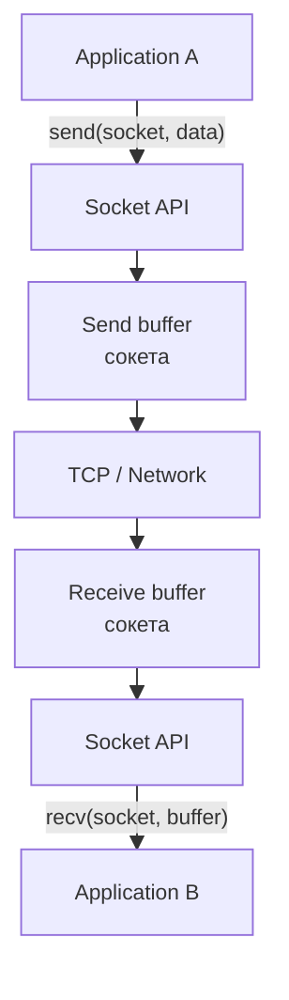

---

## Оглавление

- [[#1. Сокет|1. Сокет]]
- [[#2. TCP-сокеты и их жизненный цикл|2. TCP-сокеты и их жизненный цикл]]
- [[#3. UDP-сокеты|3. UDP-сокеты]]
- [[#4. TCP как byte stream и framing|4. TCP как byte stream и framing]]
- [[#5. Буферы и сетевой I/O|5. Буферы и сетевой I/O]]
- [[#6. Blocking и non-blocking I/O|6. Blocking и non-blocking I/O]]
- [[#7. I/O multiplexing и readiness-based I/O|7. I/O multiplexing и readiness-based I/O]]
- [[#8. Completion-based I/O|8. Completion-based I/O]]
- [[#9. Асинхронный сетевой I/O в .NET|9. Асинхронный сетевой I/O в .NET]]
- [[#10. От сокета до HTTP и ASP.NET Core|10. От сокета до HTTP и ASP.NET Core]]

---

# 1. Сокет

**Сокет** — объект операционной системы, представляющий endpoint сетевого взаимодействия, через который приложение может отправлять и получать данные с использованием сетевого стека ОС.

Для работы с сокетами операционная система предоставляет **Socket API** — программный интерфейс между приложением и сетевым стеком.

```
Application / protocol implementation
              ↓
          Socket API
              ↓
          TCP / UDP
              ↓
              IP
```

Сокет является программной абстракцией, через которую приложение использует реализованные операционной системой транспортные протоколы.

## Создание сокета

При создании сокета приложение указывает, какой тип сетевого взаимодействия ему необходим.

В POSIX API:

```
socket(address_family, socket_type, protocol (TCP/UDP))
```

Одна абстракция Socket API может использоваться с разными транспортными протоколами. Состояние и поведение конкретного сокета зависят от используемого протокола.

## Сокет как объект ОС

Сам socket object существует внутри операционной системы. Приложение получает идентификатор, через который обращается к нему: например, файловый дескриптор в Unix-подобных ОС или соответствующий **handle/socket descriptor** в Windows.

С сокетом в зависимости от его состояния и используемого протокола могут быть связаны:

- локальный IP и порт
- удалённый IP и порт
- send/receive buffers
- настройки сокета
- состояние транспортного протокола

При закрытии сокета операционная система освобождает связанные с ним ресурсы.

---

# 2. TCP-сокеты и их жизненный цикл

TCP — **connection-oriented** транспортный протокол. Перед передачей данных между двумя TCP-endpoint устанавливается соединение, доступ к которому приложение получает через TCP-сокет.

На сервере существует **слушающий сокет**, привязанный к определённому локальному IP и порту:

```
Server

Listening socket
   10.0.0.5:443
        │
        ├── новое TCP-соединение → Connected socket A
        ├── новое TCP-соединение → Connected socket B
        └── новое TCP-соединение → Connected socket C
```

Слушающий сокет используется для приёма новых соединений. Для каждого установленного TCP-соединения ОС создаёт отдельный **подключённый сокет**, через который приложение обменивается данными с конкретным клиентом.

На клиентской стороне приложение создаёт сокет и инициирует соединение с endpoint сервера:

```
Client                                  Server

Client socket                       Listening socket
     │                                    │
     └──── установка TCP-соединения ──────┤
                                          │
Client connected socket  ←────────→  Server connected socket
```

Таким образом, одному TCP-соединению соответствуют два сокета — по одному на каждой стороне.

TCP-соединение обычно идентифицируется **4-tuple**:
$$(\text{source IP},\ \text{source port},\ \text{destination IP},\ \text{destination port})$$

Поэтому сервер может одновременно поддерживать множество соединений на одном порту: их удалённые endpoint и, следовательно, 4-tuple различаются.

После установления соединения подключённый сокет используется для двунаправленной передачи данных до закрытия соединения:

```
создание сокета
      ↓
установление / принятие соединения
      ↓
подключённый сокет
      ↓
обмен данными
      ↓
закрытие
```

---

# 3. UDP-сокеты

UDP — **connectionless** транспортный протокол. Для передачи данных не требуется предварительно устанавливать соединение между двумя endpoint.

UDP-сокет обычно привязывается к локальному IP и порту и может принимать и отправлять **датаграммы**:

```
                    UDP socket
                  10.0.0.5:5000
                   /     |     \
                  /      |      \
                 ↕       ↕       ↕
             Client A Client B Client C
```

В отличие от TCP, для каждого удалённого endpoint не создаётся отдельный подключённый сокет. Один UDP-сокет может обмениваться датаграммами с множеством удалённых endpoint.

Каждая UDP-датаграмма представляет отдельное сообщение и содержит информацию, необходимую для её доставки между endpoint:

```
192.168.1.10:51001 ── datagram ──► 10.0.0.5:5000

192.168.1.20:62042 ── datagram ──► 10.0.0.5:5000
```

UDP сохраняет **границы сообщений**: одна отправленная датаграмма остаётся отдельной датаграммой при получении. Это отличается от TCP, который предоставляет непрерывный поток байтов.

Упрощённый жизненный цикл UDP-сокета:

```
создание сокета
      ↓
привязка к локальному endpoint
      ↓
отправка / получение датаграмм
      ↓
закрытие
```

Таким образом, UDP-сокет представляет endpoint для обмена отдельными датаграммами и **не требует существования отдельного соединения с каждым удалённым хостом**.

---

# 4. TCP как byte stream и framing

TCP предоставляет приложению **упорядоченный надёжный поток байтов** (**byte stream**), а не последовательность отдельных сообщений.

TCP не сохраняет границы между операциями записи. 
То есть:
$$\left(send(A),send(B)\right)\ne\left(recv(A),recv(B)\right)$$

TCP гарантирует порядок и надёжную доставку байтов, но не определяет, где заканчивается одно прикладное сообщение и начинается другое.

## Framing

Поэтому протокол прикладного уровня должен самостоятельно определять **границы сообщений** в TCP-потоке. Этот механизм называется **framing**.

Типичные способы framing:

- указание длины сообщения
- специальный разделитель
- разбиение данных на явно описанные фреймы

---

# 5. Буферы и сетевой I/O

Сетевой I/O через сокет происходит не напрямую между памятью двух приложений. Между приложением и сетью находятся **буферы сокета, управляемые ОС**.

Для TCP упрощённо:



У каждого TCP-сокета существуют собственные **send buffer** и **receive buffer**.

## Send buffer

При отправке данных приложение передаёт их ОС, после чего они помещаются в send buffer сокета.

TCP-стек независимо от приложения извлекает данные из буфера и передаёт их другой стороне.

Поэтому успешное завершение операции отправки обычно означает, что данные были **приняты локальным сетевым стеком**, а не что удалённое приложение уже их получило.

## Receive buffer

Полученные из сети данные TCP-стек помещает в receive buffer соответствующего сокета.

Данные могут находиться в receive buffer до тех пор, пока приложение их не прочитает.

Поскольку TCP предоставляет **поток байтов**, операция чтения получает доступную на данный момент часть этого потока. Поэтому размер одного чтения не обязан совпадать с размером одной операции отправки:

```
Sender:
send(1000 bytes)

Receiver:
read → 300 bytes
read → 700 bytes
```

Аналогично операция записи не всегда обязана принять весь переданный приложением объём данных за один раз. Такие ситуации называют **partial reads / partial writes**.

## Backpressure

Размер буферов ограничен. Если принимающее приложение читает данные медленнее, чем они поступают, его receive buffer начинает заполняться.

Для TCP это постепенно распространяет давление обратно к отправителю.

Этот эффект называется **backpressure** — более медленный потребитель ограничивает скорость, с которой производитель может продолжать передавать данные.

Таким образом, сетевой I/O приложения фактически представляет собой взаимодействие с **буферами сокета ОС**, а сетевой стек уже занимается передачей данных между этими буферами через сеть.

---

# 6. Blocking и non-blocking I/O

Операции с сокетом могут выполняться в **blocking** или **non-blocking** режиме. Разница заключается в поведении операции, когда она **не может быть выполнена прямо сейчас**.

## Blocking I/O

В blocking-режиме операция блокирует вызвавший её поток до тех пор, пока I/O не сможет продолжиться.

Например, при чтении из TCP-сокета, в receive buffer которого пока нет данных:

```
Thread
  ↓
чтение из сокета
  ↓
данных нет
  ↓
Thread blocked
  ↓
данные появились
  ↓
чтение завершается
  ↓
Thread продолжает выполнение
```

Пока поток заблокирован, он не может выполнять другую работу.

Простейшая модель сервера поэтому может выглядеть как:

```
Connection A → Thread A
Connection B → Thread B
Connection C → Thread C
...
```

При большом количестве одновременно ожидающих соединений такая модель плохо масштабируется: значительное количество потоков существует преимущественно ради ожидания I/O.

## Non-blocking I/O

В non-blocking режиме операция **не блокирует поток**, если сейчас выполнить её невозможно.

Например, если приложение пытается прочитать данные, но receive buffer пуст:

```
Thread
  ↓
чтение из сокета
  ↓
данных нет
  ↓
операция сразу сообщает:
"сейчас прочитать нельзя"
  ↓
Thread продолжает выполнение
```

Аналогично запись может быть временно невозможна, если send buffer не может принять новые данные.

Сам по себе non-blocking режим, однако, не решает задачу эффективного ожидания:

```
while (true)
{
    try_read(socket);
}
```

Такой постоянный опрос (**busy polling**) просто расходовал бы процессорное время.

Поэтому non-blocking I/O обычно используется вместе с механизмом, позволяющим ждать **готовности множества сокетов** без постоянного их опроса:

```
non-blocking sockets
        +
I/O readiness notification
        ↓
select / poll / epoll / kqueue
```

---

# 7. I/O multiplexing и readiness-based I/O

**I/O multiplexing** — подход, позволяющий одному потоку эффективно ожидать события сразу на множестве сокетов вместо блокирующего ожидания на каждом из них отдельно.

Для этого ОС предоставляет механизмы вроде:

- `select`
- `poll`
- `epoll` — Linux
- `kqueue` — BSD/macOS

Приложение регистрирует интересующие его сокеты и ожидает, пока один или несколько из них станут **готовы к выполнению I/O**.

```
              Socket A
              Socket B
              Socket C
                  ↓
          readiness mechanism
                  ↓
       Socket B готов к чтению
       Socket C готов к записи
                  ↓
              Application
```

## Readiness-based I/O

`epoll`, `kqueue` и подобные механизмы работают преимущественно по **readiness-based** модели: ОС сообщает не о завершении операции, а о том, что сокет находится в состоянии, в котором приложение может выполнить соответствующую I/O-операцию без блокировки.

Например, готовность TCP-сокета к чтению обычно означает, что в его receive buffer появились данные, либо произошло другое событие, из-за которого операция чтения может завершиться:

```
Network
   ↓
Receive buffer сокета
   ↓
сокет становится readable
   ↓
epoll сообщает о готовности
   ↓
Thread выполняет чтение
```

Для записи аналогично: сокет считается writable, когда операция записи может продвинуться без блокировки, например send buffer способен принять данные.

Таким образом, приложение может обслуживать большое количество соединений небольшим числом потоков:

```
        Socket A ─┐
        Socket B ─┤
        Socket C ─┤
        ...       ├──→ epoll ──→ Thread
        Socket N ─┘
```

Поток большую часть времени не закреплён за конкретным соединением. Когда ОС сообщает о готовности некоторого сокета, поток выполняет необходимую работу с ним и затем может перейти к другому сокету.

Главная модель readiness-based I/O:

```
зарегистрировать множество сокетов
    ↓
ждать готовности
    ↓
ОС сообщает готовые сокеты
    ↓
выполнить I/O над ними
    ↓
снова ждать
```

---

# 8. Completion-based I/O

**Completion-based I/O** — модель, в которой приложение инициирует I/O-операцию, а ОС уведомляет приложение, когда эта операция **завершена**.

В Windows асинхронные I/O-операции могут выполняться по completion-based модели, а IOCP предоставляет масштабируемый механизм доставки уведомлений об их завершении.

В отличие от readiness-based I/O, приложение не ждёт готовности сокета, чтобы затем самостоятельно выполнить операцию. Оно заранее передаёт ОС саму операцию:

```
Application
     ↓
инициирует чтение / запись
     ↓
Operating System
     ↓
операция выполняется / ожидает возможности выполнения
     ↓
операция завершена
     ↓
completion notification
     ↓
Application
```

Например, при асинхронном чтении:

```
Application
     ↓
"прочитай данные в этот buffer"
     ↓
OS
     ↓
ожидание данных
     ↓
данные получены и операция чтения завершена
     ↓
completion notification
```

Пока операция ожидает завершения, поток приложения не обязан быть заблокирован и может использоваться для другой работы.

## Readiness и completion

Ключевое различие двух моделей заключается в моменте, когда приложение получает уведомление от ОС.

**Readiness-based I/O:**

```
Application
    │
    │ регистрирует интерес к сокету
    ▼
	OS
    │
    │ "сокет готов к чтению"
    ▼
Application
    │
    │ выполняет чтение
    ▼
Socket
```

**Completion-based I/O:**

```
Application
    │
    │ инициирует операцию чтения,
    │ предоставляя буфер
    ▼
	OS
    │
    │ выполняет / ожидает выполнения I/O
    │
    │ "операция завершена, получено N байт"
    ▼
Application
    │
    └── обрабатывает данные в своём буфере
```

То есть:

> **Readiness-based I/O сообщает о возможности выполнить операцию, а completion-based I/O — о завершении ранее инициированной операции.**

Обе модели позволяют обслуживать большое количество одновременно ожидающих I/O-операций без выделения отдельного заблокированного потока на каждую из них.

---

# 9. Асинхронный сетевой I/O в .NET

.NET предоставляет асинхронный интерфейс для работы с сокетами через `System.Net.Sockets.Socket`:

```cs
int received = await socket.ReceiveAsync(buffer);
int sent = await socket.SendAsync(buffer);
```

При асинхронной сетевой операции поток не должен оставаться заблокированным на всё время ожидания I/O.

Например:

```
Thread
  ↓
инициирует ReceiveAsync()
  ↓
I/O ещё не завершён
  ↓
async-метод приостанавливается
  ↓
Thread освобождается
  ↓
ОС / .NET ожидают сетевое событие
  ↓
I/O завершается
  ↓
выполнение async-метода продолжается
```

Таким образом, ожидание сетевого I/O **не требует отдельного заблокированного потока для каждого сокета**.

## Связь с механизмами ОС

`Socket` предоставляет единый .NET API, скрывая различия между механизмами сетевого I/O разных операционных систем.

Концептуально:

```
.NET application
       ↓
Socket / ReceiveAsync / SendAsync
       ↓
.NET networking implementation
       ↓
OS-specific I/O mechanism
       ↓
Socket / TCP
```

На разных платформах нижележащая модель различается:

```
Linux                         Windows

non-blocking sockets          asynchronous I/O
       +                            +
     epoll                         IOCP
       ↓                            ↓
 readiness notification      completion notification
```

На Linux .NET в основном использует readiness-based модель: ОС сообщает о готовности сокета, после чего runtime выполняет соответствующий I/O.

На Windows асинхронная операция может быть передана ОС и завершена через completion-based механизм IOCP.

Эти различия скрываются за одним API:

```
await socket.ReceiveAsync(buffer);
```

С точки зрения прикладного кода семантика остаётся одной:

```
инициировать I/O
      ↓
не занимать поток ожиданием
      ↓
получить завершение операции
      ↓
продолжить выполнение
```

## `async/await` и I/O

`async/await` сам по себе не выполняет I/O и не создаёт отдельный поток для ожидания. Это механизм приостановки и последующего продолжения выполнения метода.

Сетевое ожидание обеспечивается нижележащей I/O-инфраструктурой.

Когда операция ещё выполняется, `await` позволяет сохранить продолжение метода и освободить текущий поток. После завершения I/O продолжение снова получает поток для выполнения пользовательского кода.

Поэтому асинхронный сетевой I/O позволяет серверу обслуживать большое количество соединений относительно небольшим количеством потоков.

---

# 10. От сокета до HTTP и ASP.NET Core

Сокет предоставляет приложению доступ к передаваемым по сети данным, но сам не знает ничего об HTTP, HTTP-запросах или `HttpContext`.

В ASP.NET Core обработкой сетевых соединений и HTTP занимается веб-сервер **Kestrel**.

Упрощённый путь входящего HTTP-запроса:

```
Network
   ↓
TCP
   ↓
сокет
   ↓
асинхронный сетевой I/O
   ↓
Kestrel
   ↓
обработка HTTP
   ↓
HttpContext
   ↓
Middleware Pipeline
   ↓
Endpoint
```

Kestrel получает данные через сетевой I/O, интерпретирует их в соответствии с используемой версией HTTP и формирует представление запроса, доступное ASP.NET Core через `HttpContext`.

При формировании ответа процесс происходит в обратном направлении:

```
Endpoint
   ↓
HttpResponse
   ↓
Kestrel
   ↓
HTTP response
   ↓
асинхронный сетевой I/O
   ↓
сокет
   ↓
TCP
   ↓
Network
```

Таким образом, прикладной код работает уже с высокоуровневыми HTTP-абстракциями:

```cs
app.MapGet("/users/{id}", (int id) => ...);
```

а работа с сокетами, сетевым I/O и реализация HTTP скрыты за Kestrel.

