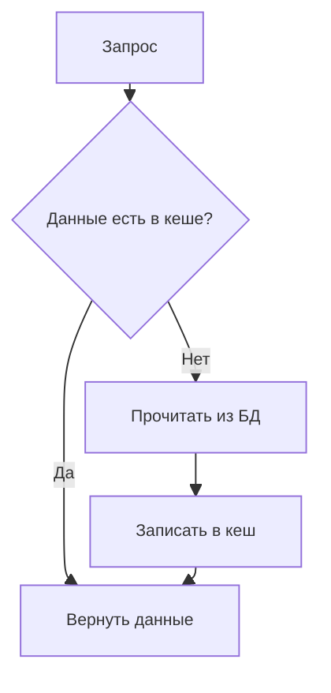
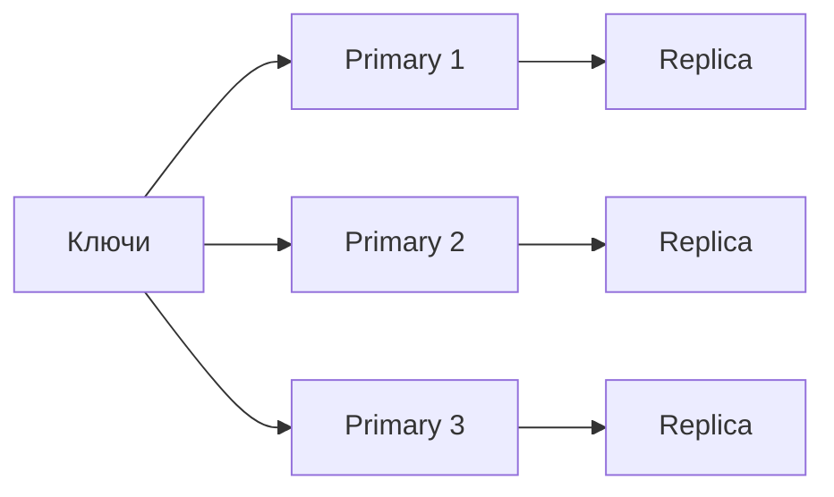

---
## Оглавление

- [[#1. Кеширование данных|1. Кеширование данных]]
	- [[#1.1. Виды кеша по месту хранения|1.1. Виды кеша по месту хранения]]
	- [[#1.2. Подходы к кешированию|1.2. Подходы к кешированию]]
	- [[#1.3. Инвалидация|1.3. Инвалидация]]
	- [[#1.4. Политики вытеснения|1.4. Политики вытеснения]]
	- [[#1.5. Политики вытеснения Redis|1.5. Политики вытеснения Redis]]
	
- [[#2. Redis|2. Redis]]
	- [[#2.1. Ключи, значения и типы данных|2.1. Ключи, значения и типы данных]]
	- [[#2.2. Redis persistence|2.2. Redis persistence]]
	- [[#2.3. Репликация|2.3. Репликация]]
	
- [[#3. `StackExchange.Redis`|3. StackExchange.Redis]]
	- [[#3.1. Установка|3.1. Установка]]
	- [[#3.2. Подключение|3.2. Подключение]]
	- [[#3.3. Основные интерфейсы|3.3. Основные интерфейсы]]
	- [[#3.4. `RedisKey`|3.4. RedisKey]]
	- [[#3.5. `RedisValue`|3.5. RedisValue]]
	- [[#3.6. API основных типов|3.6. API основных типов]]

---


# 1. Кеширование данных

**Кеширование** — временное сохранение результатов или данных для их повторного использования без повторного обращения к исходному источнику.

---
## 1.1. Виды кеша по месту хранения

### In-memory cache

Кеш хранится в памяти конкретного экземпляра приложения

- самый быстрый вариант
- не требует сетевого вызова
- данные недоступны другим экземплярам сервиса
- при перезапуске приложения кеш теряется
- плохо подходит для горизонтального масштабирования

В .NET:
```cs
IMemoryCache
```

### Distributed cache

Кеш хранится во внешнем общем хранилище

- немного медленнее из-за сетевого вызова
- доступен всем экземплярам сервиса
- поддерживает горизонтальное масштабирование
- кеш не зависит от перезапуска приложения
- требует отдельной инфраструктуры

---
## 1.2. Подходы к кешированию

### 1. Cache-Aside

**Cache-Aside** — приложение самостоятельно управляет кешем и основным хранилищем

#### Чтение



#### Изменение данных


#### Плюсы

- простая и распространённая модель
- в кеш попадают только востребованные данные
- приложение полностью контролирует TTL и инвалидацию
- при недоступности кеша приложение может читать напрямую из БД

#### Минусы

- логика кеширования находится в коде приложения
- первый запрос получает cache miss
- возможна временная несогласованность кеша и БД
- массовый cache miss может создать высокую нагрузку на БД

#### Нюансы

- Недоступность кеша при чтении
	
- Недоступность кеша после изменения БД
	
- Cache Stampede - Несколько запросов одновременно получают cache miss и обращаются к БД


### 2. Read-Through

**Read-Through** — приложение обращается к кеширующему слою, который при cache miss самостоятельно загружает данные из основного хранилища

#### Чтение

![[Pasted image 20260719083938.png]]

#### Изменение данных

![[Pasted image 20260719084204.png]]

#### Плюсы

- логика чтения централизована
- бизнес-код не содержит ручной проверки кеша

#### Минусы

- кеширующий слой должен уметь загружать данные из источника
- повышается связанность кеширующего слоя с БД
- сложнее реализовать нестандартные запросы

#### Нюансы

- кеширующий слой сам загружает данные из БД
- приложение должно уметь работать при недоступности кеша
- необходимо продумать инвалидацию и актуальность данных
- запись может быть синхронной — `Write-Through`
- запись может быть отложенной — `Write-Behind`

---
## 1.3. Инвалидация

**Инвалидация** — удаление или замена кешированного значения после изменения исходных данных

- TTL - ключ автоматически удаляется после заданного времени

- Ручная инвалидация - приложение само обновляет кеш после изменения данных

- Event-Based Invalidation - кеш удаляется обработчиком события об изменении данных

---

## 1.4. Политики вытеснения


**Политика вытеснения** определяет, какие данные удалить при достижении лимита памяти кеша

### LRU — Least Recently Used

Удаляется ключ, к которому дольше всего не обращались

Плюсы:
- хорошо работает при временной локальности запросов
- константа по времени и по памяти при записи и вытеснении

Минусы:
- Не учитывается ситуация, когда к определённым элементам обращаются часто, но с периодом, превышающим размер кэша
- Требуется перемещать элементы в конец очереди при обращении


### Clock

Приближённый вариант LRU

Ключи располагаются по кругу и имеют бит использования

```
Ключ использован
→ reference bit = 1

Стрелка дошла до ключа с bit = 1
→ сбросить bit
→ пропустить ключ

Стрелка дошла до ключа с bit = 0
→ удалить ключ
```

Плюсы:
- меньше служебных данных, чем у точного LRU
- дешёвая обработка обращений
- хорошо масштабируется при большом количестве элементов

Минусы:
- учитывает факт недавнего использования, но не точное время
- недавно использованный один раз ключ может получить дополнительный шанс
- Не учитывается ситуация, когда к определённым элементам обращаются часто, но с периодом, превышающим размер кэша


### LFU — Least Frequently Used

Удаляется ключ с наименьшей частотой обращений

Плюсы:
- сохраняет постоянно востребованные данные
- устойчив к разовым массовым обходам
- хорошо работает при стабильной популярности ключей

Минусы:
- медленнее адаптируется к изменению популярности
- старый популярный ключ может долго занимать память


### LRM - Leact Recently Modified

Удаляется ключ, который дольше всего не изменялся

Плюсы:
- удаляет давно не обновлявшиеся данные
- частые чтения не мешают вытеснению устаревшего ключа

Минусы:
- может удалить часто читаемый, но редко изменяемый ключ
- не учитывает реальную востребованность данных


### Random

Удаляется случайный ключ 

Плюсы:
- минимальные накладные расходы
- простая и быстрая политика
- подходит, когда ключи имеют примерно одинаковую ценность и частоту использования

Минусы:
- может удалить горячий ключ
- не учитывает паттерны доступа

---
## 1.5. Политики вытеснения Redis

В Redis политика вытеснения задаётся параметром `maxmemory-policy <policy>`.

Вытеснение запускается, когда Redis превышает лимит памяти `maxmemory`.

> **Eviction** — удаление ещё действующих ключей из-за нехватки памяти.  
> **Expiration** — удаление ключей из-за истечения их TTL.

### Область выбора ключей

Политики делятся на две группы:

- `allkeys-*` — Redis может вытеснить **любой ключ**
- `volatile-*` — Redis рассматривает только ключи, у которых установлен **TTL**


### Основные политики

#### 1. `noeviction`

Redis ничего не удаляет автоматически.

Когда память заканчивается, команды, добавляющие новые данные, возвращают ошибку.

#### 2. `allkeys-lru` / `volatile-lru`

Redis использует **приближённый LRU**.

Он не хранит точный глобальный двусвязный список всех ключей и не переставляет ключ при каждом обращении. Вместо этого Redis:

1. случайно выбирает несколько ключей
2. сравнивает время их последнего использования
3. сохраняет подходящих кандидатов
4. вытесняет самого старого из найденных

#### 3. `allkeys-lfu` / `volatile-lfu`

Redis использует **приближённый вероятностный LFU**.

Для каждого ключа хранится небольшой 8-битный счётчик, но он не равен точному количеству обращений. По мере роста счётчика вероятность его следующего увеличения уменьшается.

Кроме того, применяется **decay** — постепенное забывание старой популярности. Если ключ долго не используется, его оценка частоты уменьшается.

Поведение регулируется настройками:

- `lfu-log-factor` определяет, насколько быстро растёт счётчик
- `lfu-decay-time` определяет, насколько быстро Redis забывает старую популярность

При выборе жертвы Redis также не просматривает все ключи, а использует случайную выборку. 

#### 4. `allkeys-lrm` / `volatile-lrm`

Redis использует **приближённый LRM**:

1. случайно выбирает несколько ключей
2. сравнивает время последнего изменения
3. удаляет наиболее давно изменённого кандидата

Точность также регулируется через `maxmemory-samples`.

#### 5. `allkeys-random` / `volatile-random`

Удаляет рандомный ключ.

Политика почти не тратит ресурсы на анализ популярности ключей. 

#### 6. `volatile-ttl`

Удаляется ключ с TTL, у которого осталось **меньше всего времени до истечения**.

---

# 2. Redis

 <span style=""><span style="color: #16a34a;">Re</span>mote <span style="color: #16a34a;">Di</span>ctionary <span style="color: #16a34a;">S</span>erver</span> — высокопроизводительное хранилище данных типа key-value.

- хранит данные в RAM

- основная логика выполняется в одном потоке: event loop получает от ОС через готовые сетевые события и последовательно обрабатывает соответствующие команды

- автоматически выбирает наиболее эффективное внутреннее представление одного и того же логического типа в зависимости от размера и содержимого данных

Redis для одного объекта хранит:

- ключ
+ объект значения
+ тип и кодировка
+ TTL
+ метаданные вытеснения
+ структуры аллокатора

---
## 2.1. Ключи, значения и типы данных

### Ключи

Ключ — уникальная бинарно-безопасная строка, по которой Redis находит значение

Redis не поддерживает настоящие пространства имён, поэтому для разделения частей ключа обычно используется `:`

```
user:42:profile
user:42:sessions
product:15:reviews
```

Ключ может содержать любые байты и иметь размер до 512 МБ.

Общие команды:

```shell
TYPE key                    # логический тип значения по ключу
EXISTS key                  # проверка на существование
EXISTS key:1 key:2 key:3    # для нескольких вернется из значение (2)
EXPIRE key 300.             # установка ключу TTL
TTL key                     # оставшийся TTL в секундах
DEL key                     # удаление ключа
```

### Типы значений

#### 1. `String`

Последовательность байтов: текст, число, бинарные данные или сериализованный объект

```shell
SET key value               # создать или перезаписать
GET key                     # прочитать

GETEX key EX 60             # Получить значение и изменить TTL

MSET key 1 key 2            # создать несколько
MGET key key                # прочитать несколько

SET key newValue GET        # записать новое значение и вернуть старое

DEL key                     # удалить

SET key value EX 300        # сразу задать TTL в секундах, PX - мс
SET key value NX            # создать, только если ключа нет
SET key value XX            # создать, только если есть ключ

APPEND message value        # дописать строку
```

String можно использовать как атомарный счётчик:

```shell
SET counter 0              # создаем ключ counter со значением 0 
INCR counter               # +1
INCRBY counter 10          # +10
DECR counter               # -1
INCRBYFLOAT counter 0.5    # +0.5
```

Если ключ для `INCR` отсутствует, начальным значением считается `0`.

#### 2. `Hash`

Словарь `строка → строка` внутри одного Redis-ключа.

```shell
HSET user:42 name Alex age 25 city Paris   # создать Hash или обновить поля
HGET user:42 name                          # прочитать поле
HMGET user:42 name age                     # прочитать несколько полей
HGETALL user:42                            # получить весь Hash
HDEL user:42 city                          # удалить поле
DEL user:42                                # удалить весь Hash
```

Числовые поля можно изменять атомарно:

```shell
HINCRBY user:42 balance 100
HINCRBYFLOAT user:42 rating 0.5
```

`HSET` существующего поля заменяет его значение, а нового — добавляет поле.

#### 3. `List`

Двусвязный список строк

```shell
LPUSH tasks task-1            # добавить слева
RPUSH tasks task-2            # добавить справа
LPOP tasks                    # извлечь слева
RPOP tasks                    # извлечь справа
LRANGE tasks 0 -1             # получить весь список
LINDEX tasks 0                # элемент по индексу
LLEN tasks                    # количество элементов
LTRIM tasks 0 99              # оставить указанный диапазон
```

Создаётся автоматически при первом `LPUSH` или `RPUSH`.

#### 4. `Set`

Неупорядоченное множество уникальных строк

```shell
SADD roles:42 admin editor    # добавить элементы
SREM roles:42 editor          # удалить элемент
SISMEMBER roles:42 admin      # проверить наличие
SMEMBERS roles:42             # получить все элементы
SCARD roles:42                # количество элементов
SPOP roles:42                 # извлечь случайный элемент
```

Операции над множествами:

```shell
SINTER set:a set:b             # пересечение
SUNION set:a set:b             # объединение
SDIFF set:a set:b              # разность
```

#### 5. `Sorted Set`

Множество уникальных элементов, каждому из которых соответствует числовой `score`. Элементы упорядочиваются по этому значению

```shell
ZADD leaderboard 100 alice 80 bob   # добавить элементы
ZADD leaderboard 120 alice          # изменить score
ZINCRBY leaderboard 10 bob          # увеличить score
ZRANGE leaderboard 0 -1 WITHSCORES  # получить по возрастанию
ZRANGE leaderboard 0 -1 REV         # получить по убыванию
ZRANK leaderboard alice             # позиция элемента
ZSCORE leaderboard alice            # получить score
ZREM leaderboard bob                # удалить элемент
```

#### 6. `Redis JSON`

Хранит документ в разобранном древовидном виде и позволяет работать с отдельными полями через JSONPath.

Создание документа:

```shell
JSON.SET user:42 $ '{"name":"Alex","age":25,"tags":[]}'
```

Чтение:

```shell
JSON.GET user:42 $
JSON.GET user:42 $.name
JSON.TYPE user:42 $.age
```

Изменение отдельных полей:

```shell
JSON.SET user:42 $.name '"Bob"'
JSON.NUMINCRBY user:42 $.age 1
JSON.ARRAPPEND user:42 $.tags '"admin"'
JSON.MERGE user:42 $ '{"active":true}'
```

Удаление:

```shell
JSON.DEL user:42 $.tags
JSON.DEL user:42 $
```

---
## 2.2. Redis persistence

Два механизма:

#### RDB

Периодические снимки всех данных

- компактный файл
- быстрое восстановление
- подходит для бэкапов
- возможна потеря данных после последнего снимка

#### AOF

Журнал всех операций записи

- изменения дописываются в конец файла
- меньше риск потери данных
- занимает много места
- восстановление обычно медленнее

---

## 2.3. Репликация

### Primary и Replica

Запись обычно выполняется в `Primary`, после чего изменения асинхронно передаются репликам

**Redis Sentinel** — это отдельный процесс-наблюдатель, который обеспечивает high availability для обычного нешардированного Redis
### Без Sentinel

При отказе Primary переключение выполняется вручную:

```
Primary недоступен
→ выбрать реплику
→ назначить её новым Primary
→ перенастроить остальные реплики и клиентов
```

Сама по себе репликация не обеспечивает автоматический failover.

### Redis Sentinel

**Sentinel** следит за состоянием Primary и реплик и автоматически управляет переключением

```
обнаружить отказ
→ согласовать его между Sentinel
→ выбрать реплику
→ сделать её новым Primary
→ сообщить клиентам новый адрес
```

Обычно запускается несколько Sentinel, чтобы решение об отказе принималось кворумом, а сам Sentinel не становился единой точкой отказа.

### Redis Cluster

**Redis Cluster** разделяет данные между несколькими Primary-узлами



Каждый Primary отвечает только за часть ключей, то есть за отдельный шард. У каждого шарда могут быть свои реплики, которые используются для автоматического failover. 

Sentinel для Redis Cluster не требуется, потому что он уже сам содержит механизм мониторинга и автоматического failover.


---
# 3. `StackExchange.Redis`

Библиотека `.NET` для Redis.

- Поддержка Redis АРІ
- Пайплайнинг запросов
- Честный async-await
- Поддержка redis cluster

### Pipelining

**Pipelining** — отправка нескольких команд без ожидания ответа после каждой. Это уменьшает количество сетевых ожиданий

Неправильно — запросы выполняются последовательно:

```cs
var a = await db.StringGetAsync("a");
var b = await db.StringGetAsync("b");
var c = await db.StringGetAsync("c");
```

Правильно — сначала создаются все запросы, затем ожидаются результаты:

```cs
Task<RedisValue> aTask = db.StringGetAsync("a");
Task<RedisValue> bTask = db.StringGetAsync("b");
Task<RedisValue> cTask = db.StringGetAsync("c");

RedisValue[] values = await Task.WhenAll(aTask, bTask, cTask);
```

Redis выполнит команды по очереди, но они отправятся без отдельных сетевых ожиданий между ними

---
## 3.1. Установка

```shell
dotnet add package StackExchange.Redis
```

## 3.2. Подключение

```cs
using StackExchange.Redis;

IConnectionMultiplexer redis =
    await ConnectionMultiplexer.ConnectAsync("localhost:6379");

IDatabase db = redis.GetDatabase();
```

`ConnectionMultiplexer` потокобезопасен и должен переиспользоваться всё время жизни приложения. Создавать новое подключение для каждого запроса нельзя. Регистрировать его надо синглтоном. `GetDatabase()` возвращает лёгкий прокси-объект и не открывает новое соединение.

Регистрация через DI:

```cs
builder.Services.AddSingleton<IConnectionMultiplexer>(sp =>
{
    string connectionString =
        builder.Configuration.GetConnectionString("Redis")
        ?? throw new InvalidOperationException("Redis connection is missing");

    ConfigurationOptions options =
        ConfigurationOptions.Parse(connectionString);

    options.LoggerFactory =
        sp.GetRequiredService<ILoggerFactory>();

    return ConnectionMultiplexer.Connect(options);
});
```

## 3.3. Основные интерфейсы

```cs
IConnectionMultiplexer   // соединения, топология, переподключение

IDatabase                // обычные команды над данными

ISubscriber              // Pub/Sub

IServer                  // команды конкретного узла
```

```cs
IDatabase db = redis.GetDatabase();
ISubscriber subscriber = redis.GetSubscriber();

EndPoint endpoint = redis.GetEndPoints().First();
IServer server = redis.GetServer(endpoint);
```

---
## 3.4. `RedisKey`

`RedisKey` — бинарно-безопасный ключ Redis. Обычно создаётся из `string`, но также поддерживает `byte[]`, `null` нельзя. Преобразования выполняются неявно.

```cs
RedisKey key1 = "user:42";
RedisKey key2 = $"product:{productId}";

// Бинарный ключ
RedisKey key3 = new byte[] { 1, 2, 3 };

// Можно передавать обычную строку напрямую
await db.StringSetAsync("user:42:name", "Alex");

// Методы, возвращающие ключи, обычно возвращают RedisKey
RedisKey key = await db.KeyRandomAsync();

// Обратное преобразование
string? textKey = key;
byte[]? binaryKey = key;
```

### Формирование ключей

```cs
RedisKey UserKey(long id) => $"users:{id}";
RedisKey SessionKey(Guid id) => $"sessions:{id:N}";

await db.StringSetAsync(
    UserKey(42),
    "Alex",
    TimeSpan.FromMinutes(5));
```

На практике ключи формируют централизованно, чтобы избежать опечаток:

```cs
public static class RedisKeys
{
    public static RedisKey User(long id) => $"users:{id}";
    public static RedisKey UserRoles(long id) => $"users:{id}:roles";
    public static RedisKey Product(long id) => $"products:{id}";
}
```

---
## 3.5. `RedisValue`

`RedisValue` — универсальное представление значения Redis. Он поддерживает строки, байты, числа, `bool` и другие примитивные типы. Произвольные C#-объекты автоматически не сериализуются.

### Создание значений

Преобразование из обычных типов выполняется неявно:

```cs
RedisValue text = "Alex";
RedisValue integer = 42;
RedisValue number = 3.14;
RedisValue flag = true;
RedisValue bytes = new byte[] { 1, 2, 3 };

await db.StringSetAsync("name", text);
await db.StringSetAsync("age", integer);
await db.StringSetAsync("enabled", flag);
```

Поэтому обычно `RedisValue` явно не создаётся:

```cs
await db.StringSetAsync("user:42:name", "Alex");
await db.StringSetAsync("counter", 100);
await db.HashSetAsync("user:42", "age", 25);
```

`bool` сохраняется как число:

```cs
RedisValue enabled = true;  // 1
RedisValue disabled = false; // 0
```

При обратном преобразовании к `bool` допускаются только `0` и `1`.

### Чтение значения

```cs
RedisValue value =
    await db.StringGetAsync("user:42:name");

if (value.IsNull)
{
    // Ключ не существует
    return;
}

string name = value.ToString();
```

Также можно использовать явное преобразование:

```cs
string? name = await db.StringGetAsync("user:42:name");
int age = (int)await db.StringGetAsync("user:42:age");
double rating = (double)await db.StringGetAsync("user:42:rating");
bool enabled = (bool)await db.StringGetAsync("user:42:enabled");
byte[]? content = await db.StringGetAsync("file:42");
```

Преобразование **в** `RedisValue` обычно неявное, а преобразование **из** `RedisValue` в число или `bool` — явное, поскольку оно может завершиться ошибкой при неподходящем содержимом.

### Безопасное чтение чисел

```cs
RedisValue value =
    await db.StringGetAsync("counter");

if (value.TryParse(out long count))
{
    Console.WriteLine(count);
}
else
{
    // Значение отсутствует или имеет неверный формат
}
```

Прямое преобразование бросит исключение при некорректном значении:

```cs
RedisValue value = "not-a-number";

long count = (long)value; // InvalidCastException
```

Для пользовательских или потенциально повреждённых данных лучше применять `TryParse`.

### `null` и пустая строка

Основные свойства:

```cs
value.IsNull         // значение отсутствует
value.IsNullOrEmpty  // отсутствует или имеет нулевую длину
value.HasValue       // не null и не пустое
```

`HasValue` возвращает `false` и для отсутствующего значения, и для пустой строки. Для точной проверки существования нужно использовать `IsNull`.

```cs
RedisValue value =
    await db.StringGetAsync("key");

if (value.IsNull)
{
    // Ключ отсутствует
}
else
{
    // Ключ существует, даже если внутри пустая строка
}
```

### Числовой `null`

При прямом приведении отсутствующего значения к числу библиотека возвращает `0`, повторяя семантику числовых Redis-команд:

```cs
RedisValue missing =
    await db.StringGetAsync("missing-key");

long value = (long)missing; // 0
```

Чтобы отличать отсутствующий ключ от настоящего нуля, используется nullable-тип:

```cs
int? value =
    (int?)await db.StringGetAsync("counter");

if (value is null)
{
    // Ключ отсутствует
}
```

### Объекты и JSON

`RedisValue` не умеет автоматически сохранять произвольные классы:

```cs
public sealed record User(long Id, string Name);

User user = new(42, "Alex");

// Так нельзя
// RedisValue value = user;
```

Объект необходимо сериализовать:

```cs
User user = new(42, "Alex");

string json = JsonSerializer.Serialize(user);

await db.StringSetAsync(
    RedisKeys.User(user.Id),
    json,
    TimeSpan.FromMinutes(5));
```

Чтение:

```cs
RedisValue value =
    await db.StringGetAsync(RedisKeys.User(42));

User? user = value.IsNull
    ? null
    : JsonSerializer.Deserialize<User>(value.ToString());
```

### Коллекции

Для множественных операций используются массивы типов клиента:

```cs
RedisKey[] keys =
{
    "user:1",
    "user:2",
    "user:3"
};

RedisValue[] values =
    await db.StringGetAsync(keys);
```

Hash использует `RedisKey` для самого Hash и `RedisValue` для полей и значений:

```cs
RedisKey key = "user:42";

HashEntry[] entries =
{
    new("name", "Alex"),
    new("age", 25)
};

await db.HashSetAsync(key, entries);

RedisValue field = "name";
RedisValue name = await db.HashGetAsync(key, field);
```

Поле Hash является `RedisValue`.

---
## 3.6. API основных типов

### 1. `String`

```cs
RedisKey key = "user:42:name";

// Создать или перезаписать значение
bool saved = await db.StringSetAsync(key, "Alex");

// Записать значение с TTL
await db.StringSetAsync(
    key,
    "Alex",
    expiry: TimeSpan.FromMinutes(5));

// Записать, только если ключа ещё нет — SET NX
bool created = await db.StringSetAsync(
    key,
    "Alex",
    expiry: TimeSpan.FromMinutes(5),
    when: When.NotExists);

// Записать, только если ключ уже существует — SET XX
bool updated = await db.StringSetAsync(
    key,
    "Bob",
    when: When.Exists);

// Получить значение
RedisValue value = await db.StringGetAsync(key);

if (!value.IsNull)
{
    string name = value.ToString();
}

// Получить несколько значений — порядок совпадает с порядком ключей
RedisKey[] keys =
{
    "user:1:name",
    "user:2:name"
};

RedisValue[] values = await db.StringGetAsync(keys);

// Атомарный счётчик
long count = await db.StringIncrementAsync("requests");

// Увеличить на заданное число
long newCount = await db.StringIncrementAsync("requests", 10);

// Уменьшить
long remaining = await db.StringDecrementAsync("stock:42");

// Получить значение и сразу удалить ключ
RedisValue token = await db.StringGetDeleteAsync("token:42");

// Удалить ключ
bool deleted = await db.KeyDeleteAsync(key);
```

### 2. `Hash`

```cs
RedisKey key = "user:42";

// Создать Hash или записать несколько полей
await db.HashSetAsync(
    key,
    new HashEntry[]
    {
        new("name", "Alex"),
        new("age", 25),
        new("city", "Paris")
    });

// Добавить или обновить одно поле
await db.HashSetAsync(key, "name", "Bob");

// Записать поле, только если его ещё нет
bool created = await db.HashSetAsync(
    key,
    "email",
    "bob@example.com",
    When.NotExists);

// Получить одно поле
RedisValue name = await db.HashGetAsync(key, "name");

// Получить несколько полей
RedisValue[] fields = await db.HashGetAsync(
    key,
    new RedisValue[] { "name", "age" });

// Получить весь Hash
HashEntry[] user = await db.HashGetAllAsync(key);

foreach (HashEntry entry in user)
{
    RedisValue field = entry.Name;
    RedisValue fieldValue = entry.Value;
}

// Проверить наличие поля
bool hasEmail = await db.HashExistsAsync(key, "email");

// Атомарно изменить числовое поле
long age = await db.HashIncrementAsync(key, "age", 1);

// Удалить одно поле
bool fieldDeleted = await db.HashDeleteAsync(key, "city");

// Удалить несколько полей
long deletedCount = await db.HashDeleteAsync(
    key,
    new RedisValue[] { "email", "age" });

// Количество полей
long length = await db.HashLengthAsync(key);
```

### 3. `List`

```cs
RedisKey key = "tasks";

// Добавить элемент слева
long length = await db.ListLeftPushAsync(key, "task-1");

// Добавить элемент справа
await db.ListRightPushAsync(key, "task-2");

// Добавить несколько элементов
await db.ListRightPushAsync(
    key,
    new RedisValue[] { "task-3", "task-4" });

// Получить и удалить первый элемент
RedisValue first = await db.ListLeftPopAsync(key);

// Получить и удалить последний элемент
RedisValue last = await db.ListRightPopAsync(key);

// Получить диапазон элементов
RedisValue[] tasks = await db.ListRangeAsync(
    key,
    start: 0,
    stop: -1);

// Получить элемент по индексу
RedisValue item = await db.ListGetByIndexAsync(key, 0);

// Получить длину списка
long count = await db.ListLengthAsync(key);

// Оставить только первые 100 элементов
await db.ListTrimAsync(key, 0, 99);

// Удалить первое найденное значение
long removed = await db.ListRemoveAsync(
    key,
    "task-2",
    count: 1);
```

### 4. `Set`

```cs
RedisKey key = "roles:user:42";

// Добавить один элемент
bool added = await db.SetAddAsync(key, "admin");

// Добавить несколько элементов
long addedCount = await db.SetAddAsync(
    key,
    new RedisValue[] { "editor", "support" });

// Проверить наличие элемента
bool isAdmin = await db.SetContainsAsync(key, "admin");

// Получить все элементы
RedisValue[] roles = await db.SetMembersAsync(key);

// Получить количество элементов
long count = await db.SetLengthAsync(key);

// Удалить элемент
bool removed = await db.SetRemoveAsync(key, "support");

// Извлечь случайный элемент с удалением
RedisValue random = await db.SetPopAsync(key);

// Получить случайный элемент без удаления
RedisValue member = await db.SetRandomMemberAsync(key);
```

Операции над множествами:

```cs
RedisKey setA = "roles:team-a";
RedisKey setB = "roles:team-b";

// Пересечение
RedisValue[] intersection = await db.SetCombineAsync(
    SetOperation.Intersect,
    setA,
    setB);

// Объединение
RedisValue[] union = await db.SetCombineAsync(
    SetOperation.Union,
    setA,
    setB);

// Разность A - B
RedisValue[] difference = await db.SetCombineAsync(
    SetOperation.Difference,
    setA,
    setB);
```

### 5. `Sorted Set`

```cs
RedisKey key = "leaderboard";

// Добавить один элемент со score
bool added = await db.SortedSetAddAsync(
    key,
    "alice",
    score: 100);

// Добавить несколько элементов
long addedCount = await db.SortedSetAddAsync(
    key,
    new SortedSetEntry[]
    {
        new("bob", 80),
        new("kate", 120)
    });

// Обновить score существующего элемента
await db.SortedSetAddAsync(key, "alice", 150);

// Атомарно увеличить score
double newScore = await db.SortedSetIncrementAsync(
    key,
    "bob",
    10);

// Получить score
double? score = await db.SortedSetScoreAsync(key, "alice");

// Получить позицию по возрастанию score
long? rank = await db.SortedSetRankAsync(
    key,
    "alice",
    Order.Ascending);

// Получить позицию по убыванию score
long? descendingRank = await db.SortedSetRankAsync(
    key,
    "alice",
    Order.Descending);

// Получить топ-10 вместе со score
SortedSetEntry[] top = await db.SortedSetRangeByRankWithScoresAsync(
    key,
    start: 0,
    stop: 9,
    order: Order.Descending);

foreach (SortedSetEntry entry in top)
{
    RedisValue member = entry.Element;
    double memberScore = entry.Score;
}

// Получить элементы с определённым диапазоном score
SortedSetEntry[] range = await db.SortedSetRangeByScoreWithScoresAsync(
    key,
    start: 80,
    stop: 150,
    order: Order.Descending);

// Получить количество элементов
long count = await db.SortedSetLengthAsync(key);

// Удалить элемент
bool removed = await db.SortedSetRemoveAsync(key, "bob");

// Удалить элементы с заданным диапазоном score
long removedCount = await db.SortedSetRemoveRangeByScoreAsync(
    key,
    start: 0,
    stop: 50);
```


