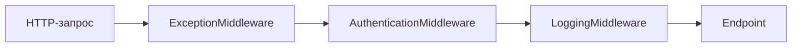

**Цепочка обязанностей** — поведенческий паттерн, который передаёт запрос последовательно по цепочке обработчиков, пока один из них не обработает его или запрос не дойдёт до конца цепочки

Каждый обработчик самостоятельно решает:

- обработать запрос
- передать его следующему обработчику
- обработать запрос и затем продолжить цепочку
- остановить дальнейшую обработку

## Когда применять

Паттерн подходит, когда:

- заранее неизвестно, какой объект должен обработать запрос
- запрос может пройти через несколько этапов обработки
- состав и порядок обработчиков должны настраиваться динамически
- обработчик может остановить дальнейшее выполнение
- нужно избавиться от большого количества условных переходов между обработчиками

---

## UML

![[2026-07-29_17-36-10.png]]

## Участники диаграммы

- **Client**
- **Handler**
- **ConcreteHandler1**
- **ConcreteHandler2**

---

# Формальное представление

## Handler

`Handler` определяет общий механизм обработки и хранит ссылку на следующий обработчик

```cs
public abstract class Handler
{
    public Handler? Successor { get; set; }

    protected Handler()
    {
    }

    public abstract void HandleRequest(int condition);

    protected void PassToSuccessor(int condition)
    {
        Successor?.HandleRequest(condition);
    }
}
```

Свойство `Successor` образует цепочку:

```
Handler
└── Successor
    └── Successor
        └── ...
```


## ConcreteHandler1

Первый обработчик проверяет, способен ли он обработать запрос

```cs
public sealed class ConcreteHandler1 : Handler
{
    public ConcreteHandler1()
    {
    }

    public override void HandleRequest(int condition)
    {
        if (condition < 10)
        {
            Console.WriteLine(
                $"ConcreteHandler1 обработал {condition}");

            return;
        }

        PassToSuccessor(condition);
    }
}
```

Когда условие не подходит, запрос передаётся преемнику


## ConcreteHandler2

```cs
public sealed class ConcreteHandler2 : Handler
{
    public ConcreteHandler2()
    {
    }

    public override void HandleRequest(int condition)
    {
        if (condition < 20)
        {
            Console.WriteLine(
                $"ConcreteHandler2 обработал {condition}");

            return;
        }

        PassToSuccessor(condition);
    }
}
```

Если следующего обработчика нет, запрос остаётся необработанным


## Client

`Client` собирает цепочку и передаёт запрос её первому элементу

```cs
public static class Client
{
    public static void Main()
    {
        var firstHandler = new ConcreteHandler1();
        var secondHandler = new ConcreteHandler2();

        firstHandler.Successor = secondHandler;

        firstHandler.HandleRequest(5);
        firstHandler.HandleRequest(15);
        firstHandler.HandleRequest(25);
    }
}
```

---

# ASP.NET Core Middleware

Pipeline middleware — практическое применение идеи Chain of Responsibility



Каждый middleware:

- получает запрос
- выполняет свою часть обработки
- вызывает следующий middleware
- либо завершает запрос и останавливает цепочку
