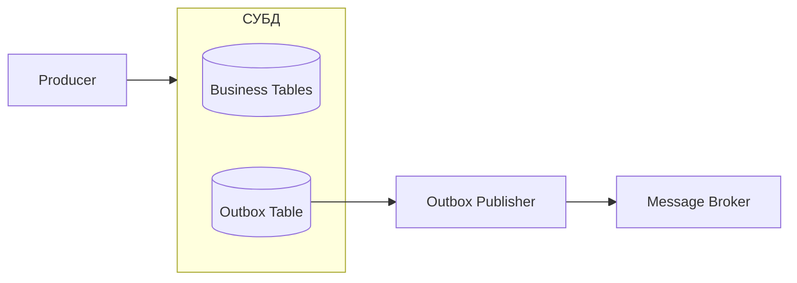

---
## Оглавление

[[#1. Назначение]]
[[#2. Общая схема]]
[[#3. Пример]]
[[#4. Повторная публикация]]
[[#5. Eventual consistency]]
[[#6. Конкурентная обработка]]
[[#7. Способы публикации]]
[[#8. Порядок сообщений]]
[[#9. Очистка Outbox]]

---

# 1. Назначение

**Outbox** обеспечивает атомарность на стороне producer и решает проблему [[Определения#^Dual write|dual write]].

Producer должен согласованно выполнить две операции:

- изменить бизнес-данные
- опубликовать сообщение в брокер

База данных и брокер являются независимыми системами, поэтому обычная локальная транзакция не может атомарно изменить их обе

Outbox заменяет прямую публикацию сообщения записью этого сообщения в таблицу базы данных

## Основной инвариант

> Бизнес-изменение и запись исходящего сообщения фиксируются в одной локальной транзакции

После успешного `COMMIT` одновременно существуют:

- изменённые бизнес-данные
- сохранённое намерение опубликовать сообщение

Если транзакция откатывается, не сохраняется ни бизнес-изменение, ни сообщение

---

# 2. Общая схема



- Producer не публикует сообщение непосредственно в брокер

- Producer сохраняет сообщение в Outbox Table

- Отдельный Publisher читает Outbox Table и публикует сохранённые сообщения

---

# 3. Пример

При создании заказа необходимо опубликовать событие `OrderCreated`

```
Бизнес-операция
    создать заказ

Исходящее событие
    OrderCreated
```

Обе записи создаются в одной транзакции базы данных

## 3.1. Структура таблицы

```sql
CREATE TABLE outbox_messages
(
    id UUID PRIMARY KEY,                 -- уникальный идентификатор сообщения
    message_type VARCHAR(200) NOT NULL,  -- тип события или команды
    payload JSONB NOT NULL,              -- сериализованное содержимое сообщения
    occurred_at TIMESTAMP NOT NULL,      -- время возникновения события
    status outbox_status NOT NULL,       -- состояние публикации
    published_at TIMESTAMP NULL          -- время успешной публикации
);
```

## Минимальный набор статусов 

```sql
CREATE TYPE outbox_message_status AS ENUM
(
    'Pending',
    'Processing',
    'Published',
    'Failed'
);
```

#### 1. Pending

Сообщение сохранено в Outbox и ожидает публикации

Система находится в этом статусе после фиксации бизнес-транзакции и до начала обработки Publisher

#### 2. Processing

Сообщение захвачено одним из экземпляров Publisher и в текущий момент отправляется в брокер

Система находится в этом статусе между началом попытки публикации и получением результата от брокера

#### 3. Published

Брокер подтвердил приём сообщения, а Publisher зафиксировал успешную публикацию в Outbox

Система находится в этом статусе после завершения публикации и обновления записи в базе данных

#### 4. Failed

Публикация не может быть продолжена автоматически из-за исчерпания числа попыток или неисправимой ошибки

Система находится в этом статусе после применения политики retry и принятия решения о необходимости ручного вмешательства

## 3.2. Транзакция Producer

```sql
BEGIN;

INSERT INTO orders
(
    id,
    customer_id,
    status
)
VALUES
(
    :order_id,
    :customer_id,
    'Created'
);

INSERT INTO outbox_messages
(
    id,
    message_type,
    payload,
    occurred_at,
    status,
    published_at
)
VALUES
(
    :message_id,
    'OrderCreated',
    :payload,
    CURRENT_TIMESTAMP,
    'Pending',
    NULL
);

COMMIT;
```

---

## 3.3. Псевдокод Producer

```cs
async Task CreateOrder(CreateOrderCommand command)
{
	// начало транзации
    await database.BeginTransactionAsync();

    try
    {
        var order = new Order
        {
            Id = command.OrderId,
            CustomerId = command.CustomerId,
            Status = OrderStatus.Created
        };
		
		// вставка в бизнес-таблицу
        await database.InsertAsync(order);
		
        var message = new OutboxMessage
        {
            Id = Guid.NewGuid(),
            MessageType = "OrderCreated",
            Payload = Serialize(new OrderCreated
            {
                MessageId = Guid.NewGuid(),
                OrderId = order.Id
            }),
            OccurredAt = UtcNow(),
            Status = OutboxMessageStatus.Pending
        };
		
		// вставка в outbox-таблицу
        await database.InsertAsync(message);
		
		// коммит
        await database.CommitTransactionAsync();
    }
    catch
    {
	    // откат
        await database.RollbackTransactionAsync();
        throw;
    }
}
```

Producer не ожидает доступности брокера внутри бизнес-транзакции

---

## 3.4. Outbox Publisher

Publisher — отдельный процесс, который доставляет сообщения из Outbox в брокер

Псевдокод:

```cs
async Task ProcessOutbox()
{
    while (!cancellationToken.IsCancellationRequested)
    {
	    // достаем стопку неопубликованных сообщений
        var messages = await database.SelectOutboxMessagesAsync(
            status: OutboxMessageStatus.Pending,
            limit: 100);
			
        foreach (var message in messages)
        {
            try
            {
	            // обновляем статус
                message.Status = OutboxMessageStatus.Processing;
                await database.UpdateAsync(message);
				
				// публикуем в брокер
                await broker.PublishAsync(
                    message.MessageType,
                    message.Payload);
				
				// обновляем статус
                message.Status = OutboxMessageStatus.Published;
                message.PublishedAt = UtcNow();
                await database.UpdateAsync(message);
            }
            catch
            {
	            // при неудаче помечаем статус Pending
                message.Status = OutboxMessageStatus.Pending;
                await database.UpdateAsync(message);
            }
        }
		
        await Delay(TimeSpan.FromSeconds(1));
    }
}
```

---

# 4. Повторная публикация

Outbox обеспечивает at least once publication.


---

# 5. Eventual consistency

Бизнес-данные и запись в Outbox согласованы сразу после локального `COMMIT`

Другие сервисы узнают об изменении позже, поэтому Outbox обеспечивает [[Модели консистентности#4. Eventual consistency|eventual consistency]]

---

# 6. Конкурентная обработка

Несколько экземпляров Publisher не должны одновременно обрабатывать одну запись.

Для этого можно использовать:
- пессимистичные блокировки
- оптимистичные блокировки
- статус Processing

---

# 7. Способы публикации

### 7.1. Polling Publisher

Фоновый процесс периодически выполняет `SELECT` к таблице Outbox

Преимущества:

- простая реализация
- полный контроль над retry
- отсутствие дополнительной инфраструктуры

Недостатки:

- периодическая нагрузка на базу
- задержка зависит от интервала polling
- требуется координация нескольких Publisher

### 7.2. Change Data Capture (CDC)

Изменения считываются из журнала транзакций базы данных

Преимущества:

- небольшая задержка публикации
- отсутствие постоянного polling таблицы
- высокая пропускная способность

Недостатки:

- более сложная инфраструктура
- зависимость от конкретной базы данных
- более сложная эксплуатация

---

# 8. Порядок сообщений

Outbox сам по себе не гарантирует строгий глобальный порядок

Порядок может нарушаться из-за:

- параллельной публикации
- повторных попыток
- нескольких Publisher
- нескольких партиций брокера
- параллельной обработки consumers

Если важен порядок событий одного агрегата, сообщение должно содержать:

```
AggregateId
Version
```

`AggregateId` обычно используется как partition key

Все события одного агрегата направляются в одну партицию брокера

`Version` позволяет consumer обнаруживать пропуски и нарушение порядка

---

# 9. Очистка Outbox

Опубликованные записи необходимо удалять или архивировать

```sql
DELETE FROM outbox_messages
WHERE status = 'Published'
  AND published_at < CURRENT_TIMESTAMP - INTERVAL '7 days';
```

Возможные стратегии:

- удаление небольшими batch-ами
- партиционирование по времени
- архивирование
- хранение ограниченного периода для диагностики


